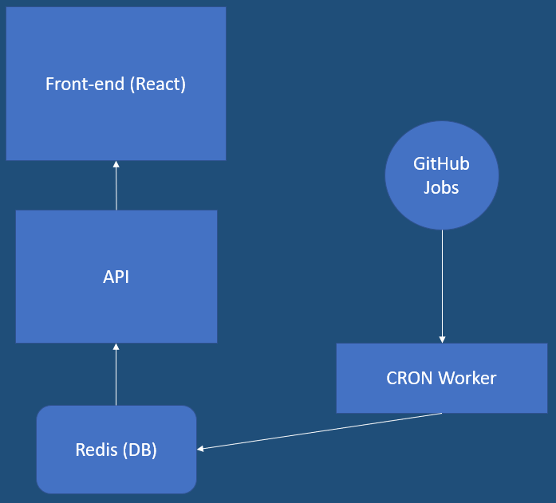

# Job Portal

Searching job can be cumbersome process, because of a lot of fraudulent websites, fake offers, advertisements, asking for money, etc. In this project I have built a website that is mostly for the benefit of freshers/entry-level job seekers.

# Architecture

The website is made using ReactJS, NodeJS, Express and Redis. The CRON Worker regularly updates the information obtained from the GitHub Jobs page and feeds it into the Redis DataBase. Using a simplle Express API call the information is fetched from the Redis DB into the frontend. The frontend is mostly made up of Material-UI.

---

### Steps to use the project

- Download the repository.
- Download all necessary dependencies.
- Make sure node, npm and redis-cli are installed on your system. Open up your terminal and enter:
  `node api/index.js`
- Keep this terimal running.
- Open up another terminal and enter:
  `cd client` & then,
  `npm start`

---

The application is local and yet to be deployed. It is still under development to add much more authentic job search pages into unity.
